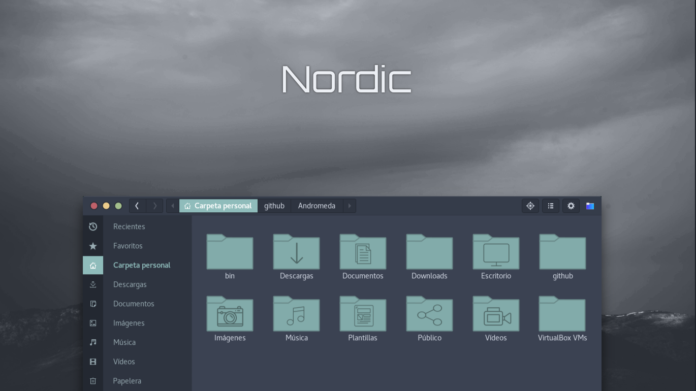

> Nordic is a Gtk3.20+ theme created using the awesome [Nord](https://github.com/arcticicestudio/nord) color pallete.

#### Installation

Extract the zip file to the themes directory i.e. `/usr/share/themes/` or `~/.themes/` (create it if necessary).

To set the theme on Gnome, run the following commands in Terminal:

```
gsettings set org.gnome.desktop.interface gtk-theme "Nordic"
gsettings set org.gnome.desktop.wm.preferences theme "Nordic"
```
or Change via distribution specific tool.

